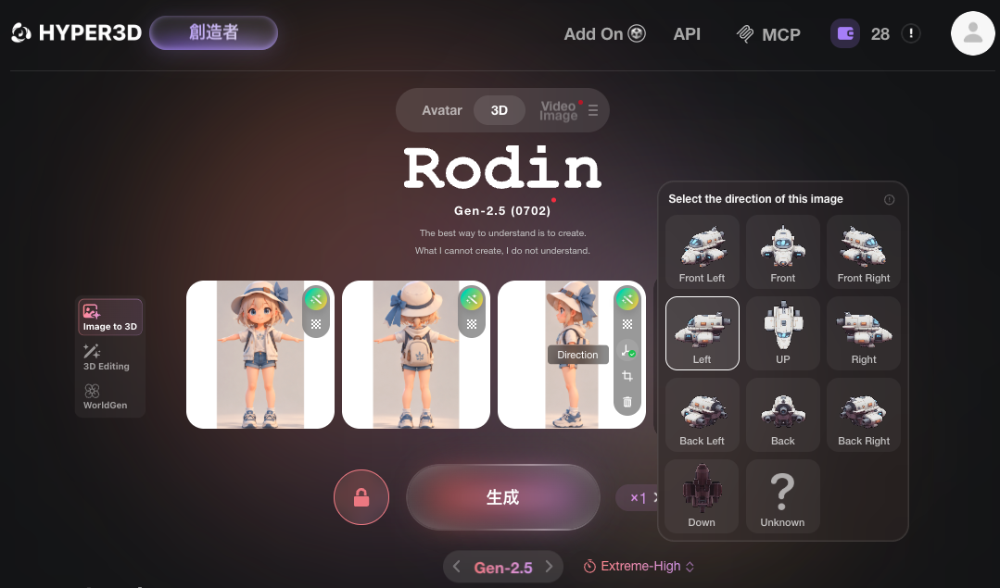
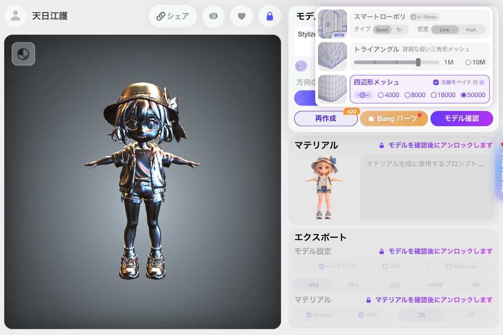
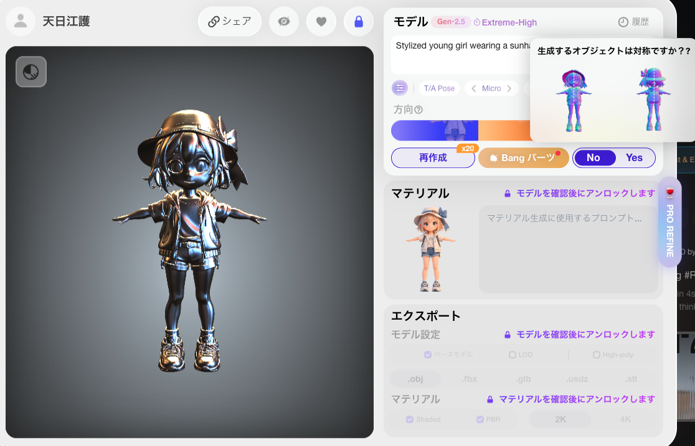
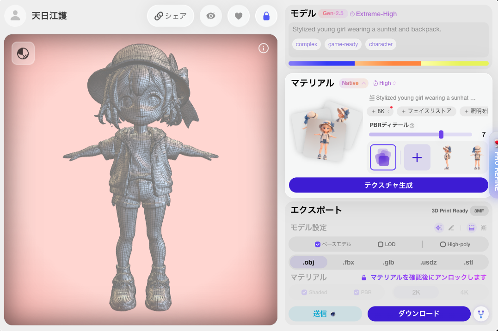
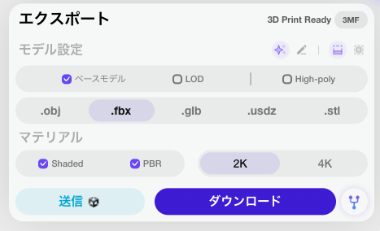

# 3Dモデル生成AI をいろいろ試してみた (Pro / Creator プラン編)

## 記述日

2026/09/09

※生成AIは進化が激しい分野のため明記
※ちょうど Tripo 3D に Multi-views input が可能になったタイミング

## 比較AI

有料プラン(Pro/Creatorなど)での検証

- Tripo 3D
- Rodin 3D

## サンプル画像

### 建築物

#### 採択の理由

* カジュアルゲームで育成要素として要求されがち
* アシンメトリー
* 構造が複雑でフロントビューからバックビューがしづらい

#### 余談

ChatGPT Images 2.0 でも、今回の画像を生成するのに 15 試行した

### ヒューマロイド

#### 採択の理由

* なるべくシンプルかつカジュアルゲームのテイストに合わせたモデル
* クリーチャーは構造によって精度差が大きそうなので人

#### 余談

ChatGPT Images 2.0 で今回の画像を生成するのに 5 試行

### アイテム

#### 採択の理由

* シンメトリー
* 表から裏が想像がつきずらそうなアイテム

#### 余談

ChatGPT Images 2.0 で今回の画像を生成するのに 1 試行

## Tripo 3D

### 前提

#### 生成手順

Multi views からモデルを生成する

上記手順で3面図を **そのまま読み込ませず** 3つに分割した上で手動で向きに合わせてアップロードすることを推奨する（その方が圧倒的に精度が高かった）

right も準備できるなら理想だが、画像生成で 4 views で整合性を取った画像を用意しようとすると、その準備に多くの時間が取られるため、今回は3面図から生成させている

### Building

#### 4 views + oblique

Front|Left|Back|Right|Oblique1|Oblique2
---|---|---|---|---|---
|||||
|||||

#### その他（ズームして見た場合）

Topology: Quad
Faces: 5,055
Vertices: 5,867

### Humanoid

#### 4 views + oblique

Front|Left|Back|Right|Oblique1|Oblique2
---|---|---|---|---|---
|||||
|||||

#### その他（ズームして見た場合）

Topology: Quad
Faces: 6,261
Vertices: 5,755

### Item

#### 4 views + oblique

Front|Left|Back|Right|Oblique1|Oblique2
---|---|---|---|---|---
|||||
|||||

#### その他（ズームして見た場合）

Topology: Quad
Faces: 5,626
Vertices: 5,287

## Rodin 3D

### 前提

#### 生成手順

Image to 3D で三面図をアップロードし、アップロードした画像右上部に表示されるオプションから Crop を選択して、三面図を3つの画像に分ける。このとき、何を表現している画像かを Direction から選択もできる

その後、必要に応じて Private にした上で、AI モデル Gen-2.5 の Extreme-High（時間がかかるが高品質）が現状 x1 コストなのでこれで生成する

また、確認は基本 Blender で行っている

なぜなら、 Rodin 3D のプレビューが軸を使った真正面などの表現ができず、ズームにも制限があったりでモデルを直接みないと確認できない点が多かったためである

### Building

Topology: Quad
Faces: 46,076
Vertices: 61,071

### Humaroid

Topology: Quad
Faces: 46,380
Vertices: 55,640

### Item

Topology: Quad
Faces: 46,802
Vertices: 52,259

