# 3Dモデル生成AI をいろいろ試してみた

## 記述日

2025/01/25

※生成AIは進化が激しい分野のため明記

## 比較AI

三面図を使って生成AIを活用すれば比較的精度の高いモデルが作れるのではないかという仮説の下、画像が読み込めること、学習への利用可否、商用利用の可否を考慮の上、以下の3つに絞って調査することにした

ツール名|無料枠(月間)|1生成の消費|クレジット単価|学習への利用|商用利用|ウリ
---|---|---|---|---|---|---
Meshy|100クレジット|20〜30点|$0.016〜0.02|無料版は利用(有料版は非公開設定可)|有料版のみ可|テクスチャの質の高さ
Tripo AI|50クレジット|10〜15点|$0.01〜0.015|無料版は利用(有料版は非公開設定可)|有料版のみ可|生成スピード
Rodin|30クレジット|1〜5クレジット|$1.5/クレジット|Private設定時原則利用されない|全プランで可|プロ向け

## 比較モデル

ChatGPT により事前に人型であること、ファンタジーすぎないこと、装飾が素朴になりすぎないことを条件に生成してもらった以下の三面図を使ってテストしていく

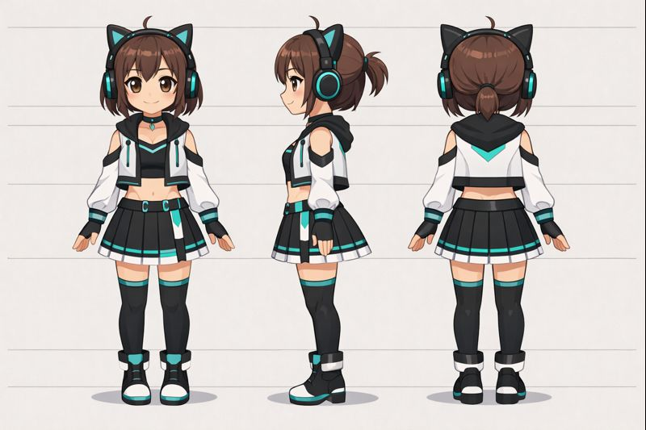

## Meshy AI

モデルによりかなり大きな差がある

Meshy 4 を使えばダウンロードできるが、生成結果は以下の通りとなった

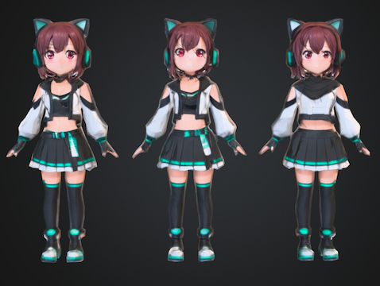

三面図だが意識できず3体生成されてしまっているがそれを無視すると、遠目にみると悪くはなさそうに見える

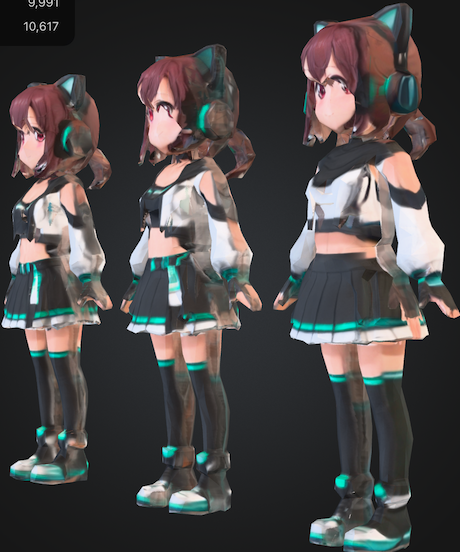

しかし、角度を変えると破綻が大きくとても使い物にはならなさそう（メッシュが陥没しているので修正も大変そう）

念の為後ろ姿も載せておく

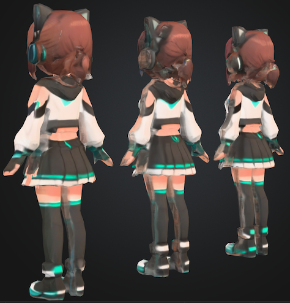

そこで、Meshy 6 を使うことにする

ただし、このモデルは有料会員にならないとダウンロードすることができないのであくまで見た目で判断していく

まずはメッシュから

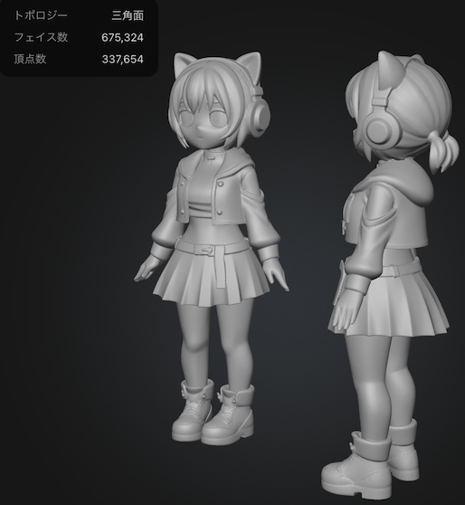

めちゃくちゃ綺麗（ただしポリゴン数も多い）。また、なぜかモデルが2体...

テクスチャも自動生成した

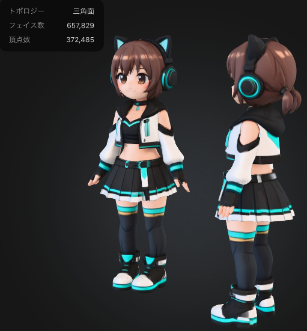

遠目に見ればかなり綺麗に見える

がしかし

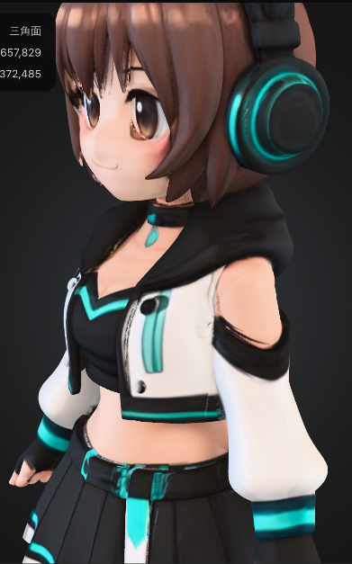

近場から見れば髪の毛や目などに破綻がある

ただし、この程度であればダウンロード後微調整でなんとかなりそう

後ろからみた姿も念の為

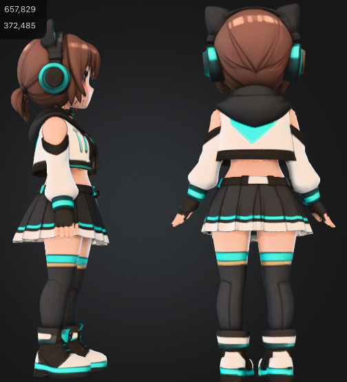
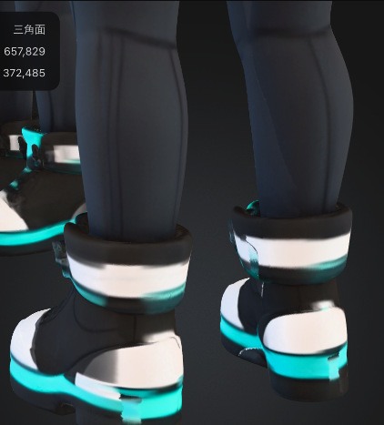

遠目に見れば違和感は少なく靴など一部に崩れは見られるが修正してなんとななりそうなレベル

余談にはなるが、 Meshy 6 にはリギングを行う機能もあるが、ポリゴン数が 10M 以下という制限があるため、一旦 10M 以下にしてみた

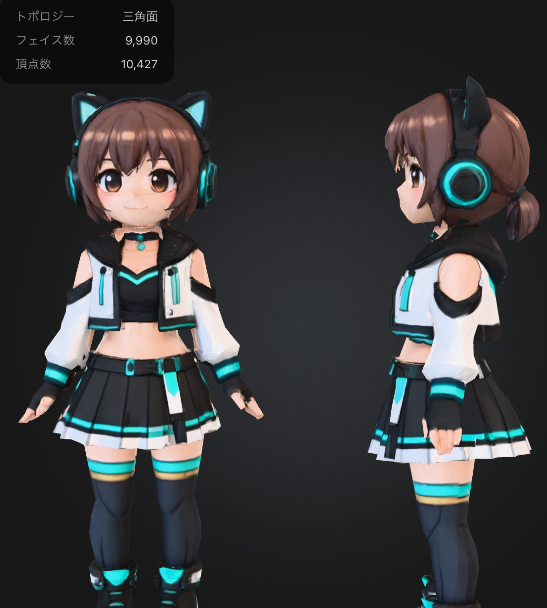
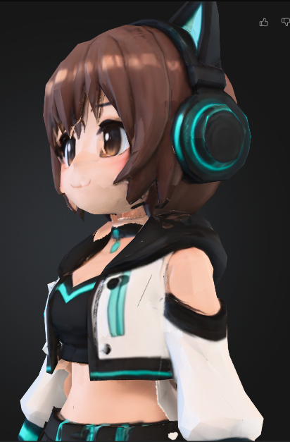
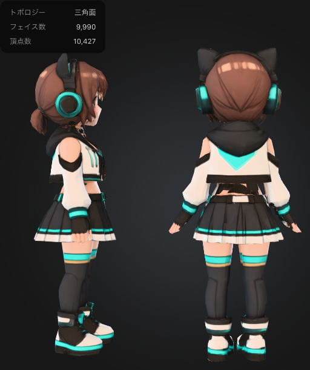

崩れは感じやすくはなったもののリテクスチャするなりて調整でなんとかなりそうではある

今回はなぜかモデルが2体生成されてしまったため、リギングするにあたってモデル1体でないと微調整ができなかったので諦めたが、何度か試すと1体しか生成されないケースもあったので、何度か試行すれば解決するかもしれない
